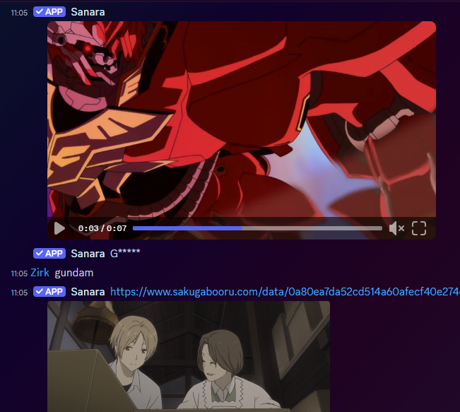
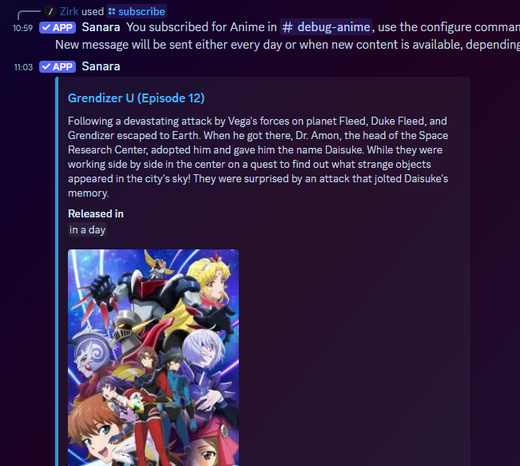

# Sanara

## Description
Sanara is a multipurpose bot that is now in more than 1300 servers (09/2021). 
Here are some of her features:
- Games, from shiritori to quizzes based on popular series (Arknights, Azur Lane, Girls Frontline...), compete against others servers for the best score
- Image search, get images from your favorite booru (Safebooru, Rule34, E621...)
- Doujinshi/Cosplay search, find links to good content and download them directly with Sanara
- Subscription, stay aware of the new anime and doujinshi airing

|  |  |  |  |
| ------------------------------------- | ----------------------------------- | --------------------------------- | ------------------------------------------------- |
| Doujin command preview                | Booru command preview               | Game command preview              | Subscription command preview                      |
 
There are also a multitude of others commands and if the one you're looking for isn't here, just suggest it

## Commands
You can see the full list on [Sanara's command page](https://sanara.zirk.eu/commands.html) 
You will also have the list of command by typing "/"

## How to invite her on my server
You can just use her invite link: <https://discord.com/oauth2/authorize?client_id=329664361016721408&scope=bot%20applications.commands>
Don't want to have NSFW commands? You can invite her SFW version called Hanaki: <https://discord.com/api/oauth2/authorize?client_id=883767204733157397&scope=bot%20applications.commands>

## Contact
If you need anything you can come [open an issue](https://github.com/Xwilarg/Sanara/issues), [come to her official server](https://discordapp.com/invite/H6wMRYV) or contact Zirk#0001 on Discord.

## Contributing
The bot is in constant developpement, I'm always improving her by adding features and fixing bugs. 
If you have any idea of some new ones, feel free to suggest them. 
If you want to add them yourself, feel free to do a pull request! (You might want to check the [developer documentation](https://sanara.zirk.eu/documentation.html) beforehand)

## Information collected
If you want to, you can also see [stats about her usage](https://sanara.zirk.eu/stats.html).

If you have any wonder about what the bot collect on you and how you can get/delete these information, you can check the [GDPR page](https://sanara.zirk.eu/documentation.html).

## Others
You also might want to see her [discordbots.org page](https://discordbots.org/bot/329664361016721408).
